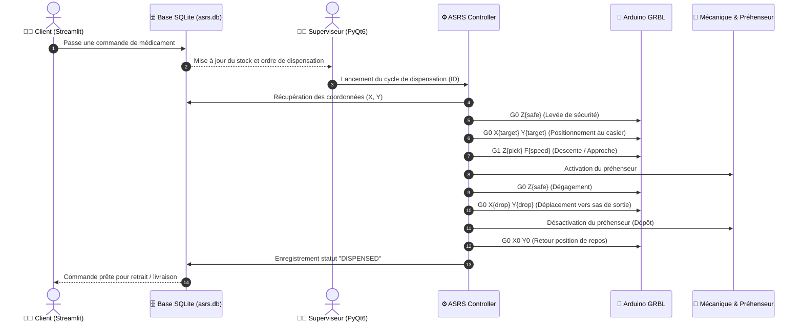

# 🏥 SkyPharma - Système de Pharmacie Autonome (Robot ASRS) & Livraison par Drone

[](https://www.python.org/)
[](https://riverbankcomputing.com/software/pyqt/)
[](https://streamlit.io/)
[](https://github.com/gnea/grbl)
[](https://www.sqlite.org/)
[]()

> **Projet de Fin d'Année (PFA)**  
> **Filière :** Cycle Ingénieur en Génie Électrique et Contrôle Industriel (GECI)  
> **Institution :** Faculté des Sciences et Techniques (FST)  
> **Auteurs :** **Bader EL BERKAOUI** & **Mohammed HSINY**  
> **Encadrante :** **Pr. Nada EL GMILI**

---

## 📌 Présentation du Projet (Abstract)

**SkyPharma** est un écosystème mécatronique et logiciel innovant dédié à l'automatisation hospitalière et pharmaceutique. Il combine :
1. **Un robot de stockage et de dispensation automatisé (ASRS - *Automated Storage and Retrieval System*)** basé sur une cinématique cartésienne H-Bot 3 axes (X, Y, Z) piloté par microcontrôleur sous firmware GRBL 1.1.
2. **Une suite logicielle complète** composée d'une **interface administrateur de supervision en temps réel (PyQt6 / SCADA)** et d'un **portail web client interactif (Streamlit)** connecté à une base de données relationnelle SQLite.
3. **Un vecteur de livraison par drone autonome (F450)** sous contrôleur de vol APM ArduPilot avec système d'accrochage/largage par servomoteur PWM pour l'acheminement urgent de médicaments vers des zones enclavées ou des services distants.

---

## 📸 Galerie & Démonstrations

| Modélisation 3D (SolidWorks) | Châssis Réel Réalisé | Interface Supervision SCADA (PyQt6) |
| :---: | :---: | :---: |
|  |  |  |

🎥 **Vidéo de démonstration complète du cycle de dispensation :** [`sky_pharma_demonstrations.mp4`](sky_pharma_demonstrations.mp4)  
📄 **Rapport technique complet (90 pages) :** [`Rapport_PFA_Vfinale.pdf`](Rapport_PFA_Vfinale.pdf)

---

## 🛠️ Architecture Matérielle (Hardware Specifications)

### 1. Robot Cartésien ASRS (Mécanique & Actionneurs)
* **Cinématique :** Structure cartésienne H-Bot (mouvements synchronisés X/Y et axe Z vertical).
* **Moteurs pas à pas :** 
  - Axes X & Y : **NEMA 17 (17HS4401)** (Couple nominal élevé, précision angulaire 1.8°/pas).
  - Axe Z (Élévateur/Plateau) : **NEMA 17 (17HS4023)**.
* **Transmission :** Courroies crantées GT2, poulies synchrones 20 dents, tiges filetées trapézoïdales et guidages linéaires sur profilés aluminium V-Slot.
* **Préhenseur :** Système d'accroche/ventouse électromécanique commandé pour extraire et déposer les boîtes de médicaments dans le sas de délivrance.

### 2. Électronique de Commande & Puissance
* **Microcontrôleur :** **Arduino UNO (ATmega328P)** exécutant le firmware haute performance **GRBL 1.1**.
* **Carte d'extension :** **CNC Shield V3** assurant le routage des signaux STEP/DIR, des fins de course et de l'alimentation.
* **Drivers de puissance :** **DRV8825** avec réglage fin du Vref (courant réglé pour éviter la perte de pas et l'échauffement) et micropas (Microstepping 1/16 - 1/32).
* **Capteurs & Sécurités :** Capteurs de fin de course mécaniques (Microswitches Endstops) sur chaque axe pour le cycle d'initialisation (*Homing* `$H`) et la limitation logicielle/matérielle des courses (*Soft/Hard limits*).
* **Alimentation & Refroidissement :**
  - Bloc d'alimentation industriel **24V DC / 15A** pour la puissance des moteurs.
  - Régulateurs abaisseurs de tension **Buck LM2596 (12V / 5V)** pour la logique et le ventilateur de refroidissement actif de la carte de puissance.
  - Communication série via liaison USB blindée reliée au PC superviseur.

### 3. Module Aérien de Livraison par Drone
* **Châssis :** Quadricoptère **DJI Flame Wheel F450**.
* **Contrôleur de vol :** **APM 2.8 ArduPilot** avec boussole et module GPS Neo-6M/8M.
* **Motorisation :** 4 moteurs Brushless **SunnySky 1400KV**, variateurs ESC 30A, hélices 8 pouces.
* **Alimentation :** Batterie **LiPo 3S 6500 mAh** (11.1V, fort taux de décharge).
* **Mécanisme de largage :** Système de loquet rotatif imprimé en 3D actionné par servomoteur commandé en PWM via canal auxiliaire de la radiocommande **FlySky FS-i6** ou waypoint de mission automatique.

---

## 💻 Architecture Logicielle (Software Stack)

```
SKYPHARMA/
├── README.md                    # Documentation centrale et guide de démarrage
├── Rapport_PFA_Vfinale.pdf      # Rapport de PFA complet (90 pages)
├── skypharma_chassis_real.jpg  # Photo du robot physique
├── skypharma_solidworks.png    # Rendu 3D SolidWorks
├── skypharma_scada.png         # Capture de l'interface SCADA
├── sky_pharma_demonstrations.mp4# Vidéo démonstrative de la dispensation
└── asrs_pharmacy_robot/        # Suite logicielle du robot
    ├── app.py                  # Point d'entrée Interface Superviseur PyQt6
    ├── app_cli.py              # Interface CLI autonome pour tests & automation
    ├── client_app.py           # Portail Web Client & Commande (Streamlit)
    ├── requirements.txt        # Dépendances Python (PyQt6, Streamlit, pyserial, pytest)
    ├── config/
    │   └── machine_config.json # Paramètres machine (vitesses, limites, homing, feedrates)
    ├── data/
    │   └── asrs.db             # Base de données SQLite3 locale synchronisée
    ├── assets/                 # Logos, illustrations et schémas
    ├── docs/                   # Spécifications G-code et documentation GRBL
    ├── src/
    │   ├── core/
    │   │   ├── asrs_controller.py   # Orchestrateur central et gestionnaire de cycle
    │   │   ├── gcode_generator.py   # Générateur de trajectoires G-code sécurisées
    │   │   ├── grbl_client.py       # Client de streaming série USB asynchrone GRBL
    │   │   ├── machine_config.py    # Modèle et validation de la configuration JSON
    │   │   └── state_machine.py     # Machine à états finis (IDLE, HOMING, DISPENSING...)
    │   ├── db/
    │   │   ├── database.py          # Couche d'accès aux données (DAO SQLite)
    │   │   ├── models.py            # Dataclasses (Medicine, Location, DispenseLog)
    │   │   └── schema.sql           # Schéma SQL des tables (medicines, dispense_history...)
    │   ├── ui/
    │   │   ├── supervision_window.py# IHM Superviseur PyQt6 (Contrôle axes, stock, logs)
    │   │   └── main_window.py      # Fenêtre principale et raccourcis
    │   └── utils/
    │       ├── logger.py           # Journalisation rotative horodatée
    │       └── exceptions.py       # Exceptions métiers personnalisées
    └── tests/                      # Suite de tests unitaires automatisés (Pytest)
```

---

## 🖥️ Description des Interfaces

### 1. Interface Administrateur & Supervision (PyQt6 - `app.py`)
L'interface administrateur est le centre de contrôle et d'exploitation du système :
* **Connexion Matérielle :** Détection automatique des ports COM, sélection du baudrate (115200) et affichage en temps réel de l'état GRBL (`Idle`, `Run`, `Hold`, `Alarm`).
* **Pilotage Manuel & Homing :** Bouton d'origine machine (*Homing Cycle* `$H`), commandes Jog pas à pas sur les axes X, Y et Z, arrêt d'urgence.
* **Gestion du Stock & Matrice de Rangement :** Ajout, modification, suppression et affichage en tableau interactif de tous les médicaments avec leurs coordonnées spatiales réelles $(X, Y)$ en millimètres.
* **Console de Commande Directe & Historique :** Envoi manuel de commandes G-code, suivi du buffer série et historique détaillé des cycles de dispensation avec horodatage.

### 2. Interface Client & Portail de Commande (Streamlit - `client_app.py`)
Une interface web moderne et réactive connectée à la même base de données locale du PC :
* **Catalogue Dynamique :** Chaque médicament enregistré sur l'interface administrateur apparaît instantanément sur Streamlit.
* **Recherche & Filtres :** Recherche textuelle en temps réel et filtre par catégorie thérapeutique.
* **Validation des Commandes :** Affichage de la disponibilité en stock, des coordonnées de casier, sélection de la quantité et validation instantanée d'une commande client qui décrémente automatiquement le stock et enregistre l'ordre de prélèvement.

---

## 🔄 Cycle de Fonctionnement & Trajectoire G-Code

Le prélèvement d'un médicament suit un cycle automatisé déterministe et sécurisé :



---

## 🚀 Guide d'Installation et d'Exécution

### 1. Prérequis
* **Python 3.10** ou supérieur.
* **Carte Arduino UNO** connectée en USB (avec firmware GRBL 1.1).

### 2. Installation des dépendances
```bash
# Aller dans le répertoire du projet
cd asrs_pharmacy_robot

# Installer les packages Python requis
pip install -r requirements.txt
```

### 3. Lancement des applications

* **Lancer l'Interface Administrateur & Supervision (PyQt6) :**
  ```bash
  python app.py
  ```

* **Lancer l'Interface Client Web (Streamlit) :**
  ```bash
  streamlit run client_app.py
  ```

* **Lancer l'Interface en Ligne de Commande (CLI) :**
  ```bash
  python app_cli.py --list
  python app_cli.py --port COM3 --home
  python app_cli.py --port COM3 --dispense 1
  ```

* **Exécuter la suite de tests unitaires :**
  ```bash
  python -m pytest
  ```

---

## 👥 Équipe du Projet & Remerciements

* **Bader EL BERKAOUI** - Élève Ingénieur en Génie Électrique & Contrôle Industriel
* **Mohammed HSINY** - Élève Ingénieur en Génie Électrique & Contrôle Industriel
* **Pr. Nada EL GMILI** - Encadrante de projet, Département Génie Électrique, Faculté des Sciences et Techniques (FST)

---

## 📜 Licence

Ce projet est distribué sous licence MIT. Libre d'utilisation dans le cadre de projets de recherche, académiques et industriels.
