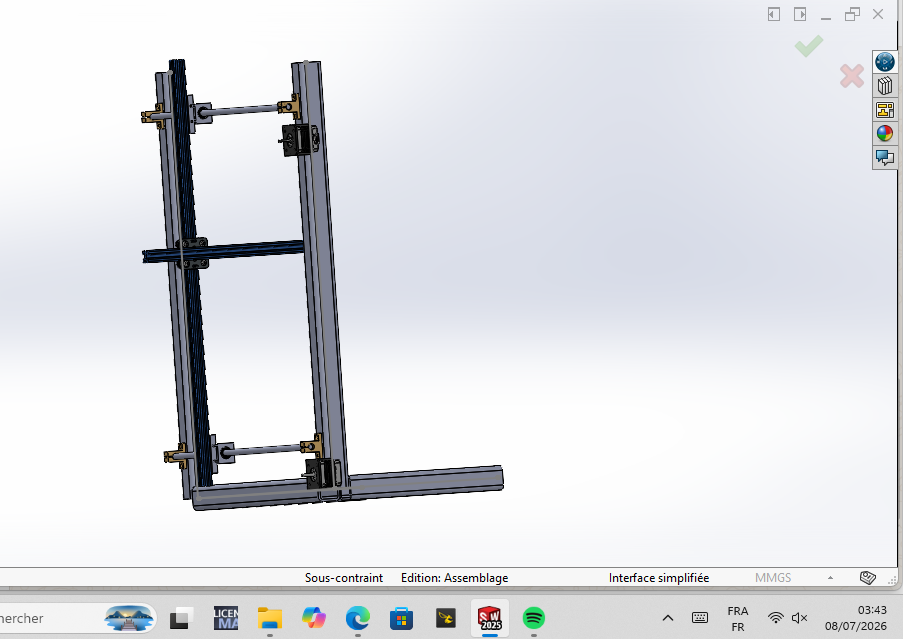
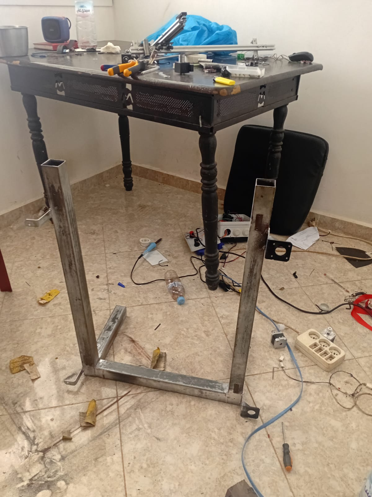
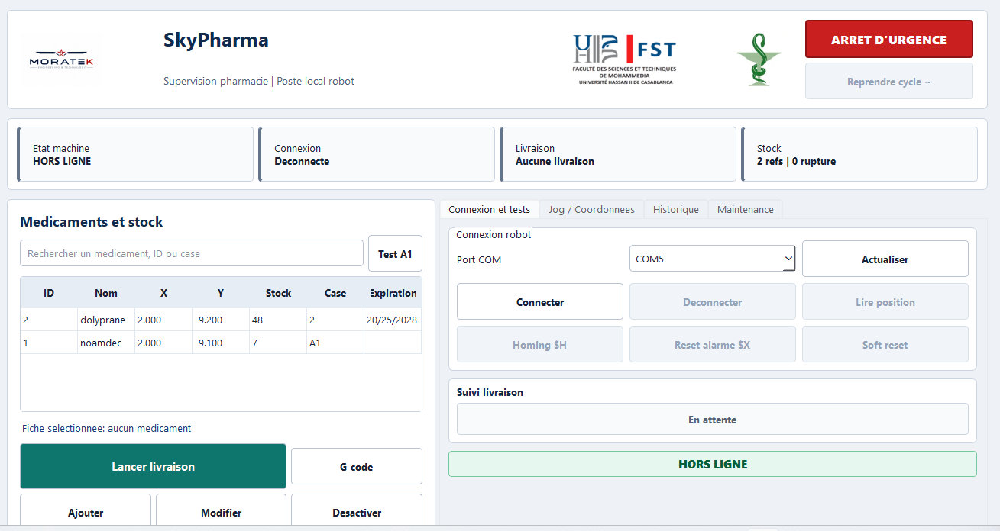
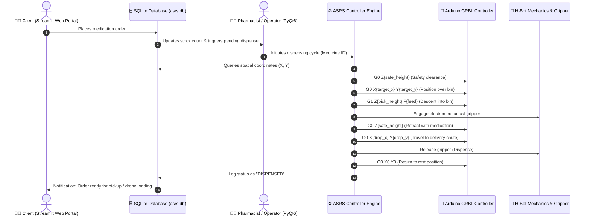

# 🏥 SkyPharma - Autonomous Pharmacy System (ASRS Robot) & Drone Delivery

[](https://www.python.org/)
[](https://riverbankcomputing.com/software/pyqt/)
[](https://streamlit.io/)
[](https://github.com/gnea/grbl)
[](https://www.sqlite.org/)
[]()
[]()

> **Final Year Engineering Project (PFA)**  
> **Major:** Electrical Engineering & Industrial Automation (GECI)  
> **Institution:** Faculty of Sciences and Techniques (FST)  
> **Author:** **Mohammed HSINY**  
> **Supervisor:** **Prof. Nada EL GMILI**

---

## 📌 Project Overview (Abstract)

**SkyPharma** is an innovative mechatronics and software ecosystem designed for hospital and pharmacy logistics automation. It integrates:
1. **An Automated Storage and Retrieval System (ASRS)** robot based on a 3-axis (X, Y, Z) Cartesian H-Bot kinematics, digitally controlled via an ATmega328P microcontroller running high-rate **GRBL 1.1** firmware.
2. **A full-stack software suite** featuring a **real-time Admin Supervision SCADA desktop application (PyQt6)** and an **interactive Web Client Portal (Streamlit)** backed by a local SQLite relational database.
3. **An Autonomous Drone Delivery Module (F450 Quadcopter)** controlled by an APM ArduPilot flight controller with a PWM servo-actuated release mechanism for urgent delivery of critical medications to remote or isolated areas.

---

## 📸 Media Gallery & Demonstrations

| 3D CAD Model (SolidWorks) | Physical Assembled Robot | Admin SCADA Supervision UI (PyQt6) |
| :---: | :---: | :---: |
|  |  |  |

🎥 **Full Dispensing Cycle Video Demonstration:** [`sky_pharma_demonstrations.mp4`](sky_pharma_demonstrations.mp4)  
📄 **Comprehensive Technical Engineering Report (90 pages):** [`Rapport_PFA_Vfinale.pdf`](Rapport_PFA_Vfinale.pdf)

---

## 🛠️ Hardware Specifications

### 1. Cartesian ASRS Robot (Mechanics & Actuation)
* **Kinematics:** H-Bot Cartesian architecture (synchronized X/Y motion with minimal moving inertia, coupled with a vertical Z-axis platform).
* **Stepper Motors:** 
  - **X & Y Axes:** **NEMA 17 (17HS4401)** (High torque, $1.8^\circ$/step precision).
  - **Z Axis (Elevator / Gripper Bed):** **NEMA 17 (17HS4023)**.
* **Transmission & Guides:** GT2 reinforced timing belts, 20-tooth synchronous pulleys, lead screws, and linear V-Slot aluminum extrusions with POM V-wheels.
* **End-Effector:** Electromechanical gripper / vacuum suction mechanism engineered to extract, hold, and release medicine packages into the dispensing chute.

### 2. Control Electronics & Power Distribution
* **Microcontroller:** **Arduino UNO (ATmega328P)** running customized **GRBL 1.1** motion control firmware.
* **Expansion Board:** **CNC Shield V3** for routing STEP/DIR signals, hardware endstops, and auxiliary relays.
* **Stepper Drivers:** **DRV8825** configured with fine-tuned reference voltages ($V_{ref}$) and microstepping (1/16 to 1/32) for smooth, silent, and stall-free motion.
* **Sensors & Safety Bounds:** Mechanical microswitch endstops on each axis enabling automated homing cycles (`$H`) and soft/hard travel limit protection.
* **Power Supply & Thermal Management:**
  - Industrial **24V DC / 15A** switching power supply unit (PSU).
  - **LM2596 Buck Step-Down Converters** regulating auxiliary 12V (active CNC Shield cooling fan) and 5V logic rails.
  - Shielded USB serial communication link to the host PC.

### 3. Drone Delivery Module (Aerial Dispatch)
* **Airframe:** **DJI Flame Wheel F450** quadcopter frame.
* **Flight Controller:** **APM 2.8 ArduPilot** with external compass and Neo-6M/8M GPS navigation module.
* **Propulsion:** 4x **SunnySky 1400KV** brushless motors, 30A ESC speed controllers, 8-inch balanced propellers.
* **Battery:** **3S 6500 mAh LiPo** (11.1V high-discharge pack).
* **Cargo Release System:** 3D-printed payload latch triggered via a PWM servomotor mapped to a telemetry waypoint or auxiliary RC channel (**FlySky FS-i6**).

---

## 💻 Software Architecture & Project Structure

```
SKYPHARMA/
├── README.md                    # Main Project Documentation (English)
├── Rapport_PFA_Vfinale.pdf      # Complete Academic PFA Report (90 pages)
├── skypharma_chassis_real.jpg  # Photo of the real hardware robot
├── skypharma_solidworks.png    # 3D CAD SolidWorks rendering
├── skypharma_scada.png         # Screenshot of the PyQt6 SCADA interface
├── sky_pharma_demonstrations.mp4# Video demonstration of dispensing cycle
└── asrs_pharmacy_robot/        # Core Robot Software Suite
    ├── app.py                  # Entry point for Admin PyQt6 GUI
    ├── app_cli.py              # Standalone CLI for headless automation & diagnostics
    ├── client_app.py           # Interactive Web Client & Ordering Portal (Streamlit)
    ├── requirements.txt        # Python dependencies (PyQt6, Streamlit, pyserial, pytest)
    ├── config/
    │   └── machine_config.json # Machine parameters (speeds, travel limits, feedrates)
    ├── data/
    │   └── asrs.db             # Shared SQLite3 relational database
    ├── assets/                 # Logos, diagrams, and reference media
    ├── docs/                   # G-code specifications and GRBL documentation
    ├── src/
    │   ├── core/
    │   │   ├── asrs_controller.py   # Central orchestrator & cycle manager
    │   │   ├── gcode_generator.py   # Safe G-code trajectory generator
    │   │   ├── grbl_client.py       # Asynchronous USB serial GRBL client
    │   │   ├── machine_config.py    # Configuration loader & validation
    │   │   └── state_machine.py     # Finite State Machine (IDLE, HOMING, DISPENSING...)
    │   ├── db/
    │   │   ├── database.py          # SQLite Data Access Object (DAO)
    │   │   ├── models.py            # Dataclasses (Medicine, Location, DispenseLog)
    │   │   └── schema.sql           # SQL tables (medicines, dispense_history, events)
    │   ├── ui/
    │   │   ├── supervision_window.py# Main PyQt6 SCADA Interface (Jog, Homing, Stock)
    │   │   └── main_window.py      # Main window utilities
    │   └── utils/
    │       ├── logger.py           # Rotating file & console logger
    │       └── exceptions.py       # Domain-specific custom exceptions
    └── tests/                      # Automated unit test suite (Pytest)
```

---

## 🖥️ System Interfaces

### 1. Administrator Supervision & SCADA Interface (PyQt6 - `app.py`)
The central desktop command center for pharmacy operators:
* **Hardware Connection:** Auto-detection of COM ports, baud rate configuration (115200), and real-time GRBL status polling (`Idle`, `Run`, `Hold`, `Alarm`).
* **Manual Motion & Homing:** Machine origin calibration (*Homing Cycle* `$H`), incremental Jog on X, Y, and Z axes, emergency stop (*Feed Hold / Soft Reset*).
* **Inventory & Coordinate Mapping:** Real-time CRUD operations for medicines, automatically linking each medicine with its physical Cartesian coordinates $(X, Y)$ in millimeters.
* **Direct G-Code Terminal & Auditing:** Manual command execution, serial buffer monitoring, and persistent timestamped dispensing history logs.

### 2. Client Web Portal & Order Interface (Streamlit - `client_app.py`)
A modern, responsive web application for patients and medical staff:
* **Real-Time Database Synchronization:** Directly reads from the shared `data/asrs.db` database. Any medication registered or edited on the Admin GUI appears instantly on the client app.
* **Search & Therapeutic Categories:** Live search bar and category filtering (e.g., Analgesic, Antibiotic, etc.).
* **Live Order Placement:** Visual stock availability badges, storage compartment preview, and one-click ordering which automatically decrements inventory and queues the dispensing cycle.

---

## 🔄 Automated Dispensing Cycle & Data Flow



---

## 🚀 Quick Start & Installation

### 1. Prerequisites
* **Python 3.10** or higher.
* **Arduino UNO** connected via USB (flashed with GRBL 1.1 firmware).

### 2. Setup Environment
```bash
# Clone the repository
git clone https://github.com/medhsiny2003/asrs_robot.git
cd asrs_robot/asrs_pharmacy_robot

# Install required Python packages
pip install -r requirements.txt
```

### 3. Running the Applications

* **Launch Admin Supervision GUI (PyQt6):**
  ```bash
  python app.py
  ```

* **Launch Client Web Ordering Portal (Streamlit):**
  ```bash
  streamlit run client_app.py
  ```

* **Launch Headless CLI Controller:**
  ```bash
  python app_cli.py --list
  python app_cli.py --port COM3 --home
  python app_cli.py --port COM3 --dispense 1
  ```

* **Run Automated Test Suite:**
  ```bash
  python -m pytest
  ```

---

## 👤 Author & Acknowledgments

* **Mohammed HSINY** - Electrical Engineering & Industrial Automation Graduate Student
* **Prof. Nada EL GMILI** - Project Supervisor, Electrical Engineering Department, Faculty of Sciences and Techniques (FST)

---

## 📜 License

This project is licensed under the MIT License - feel free to use and adapt it for research, academic, and industrial purposes.
