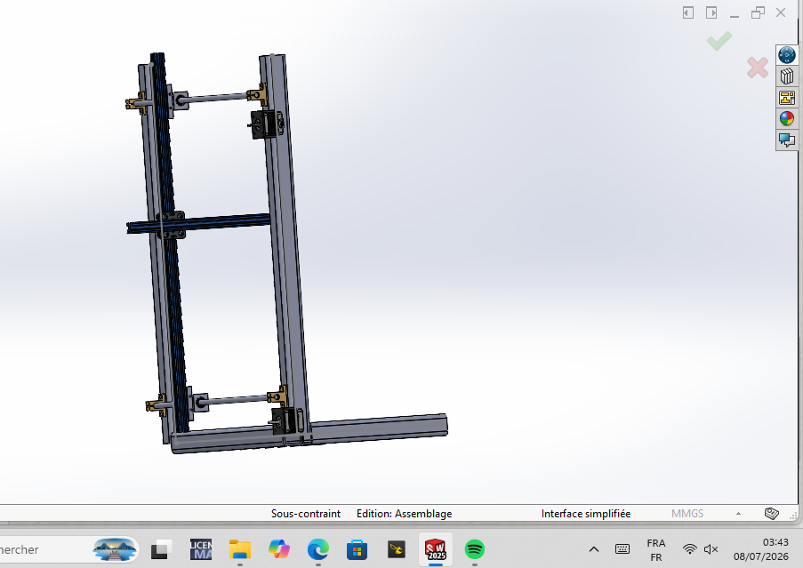
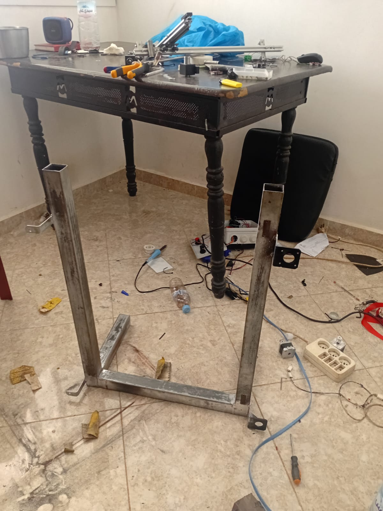
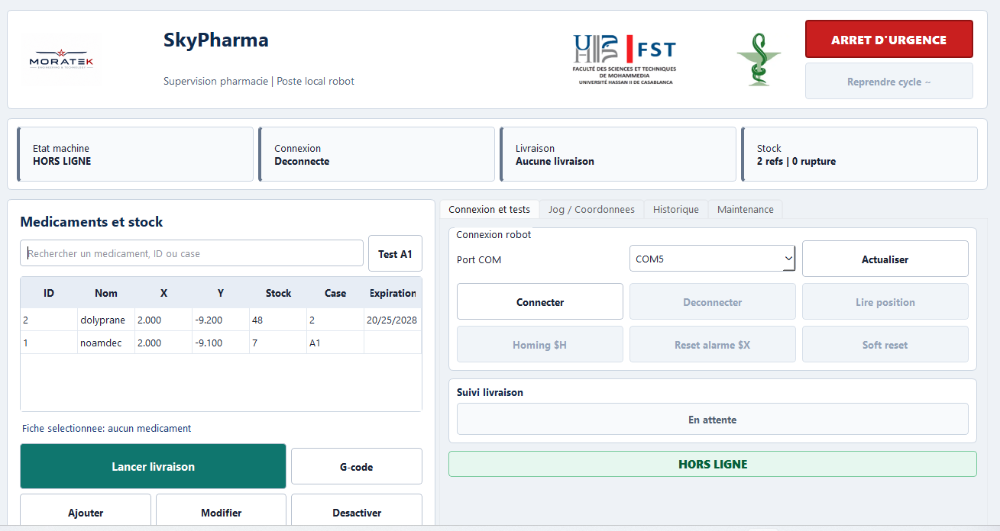
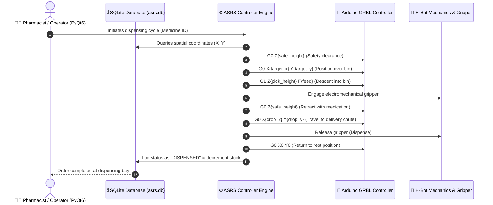

# 🏥 SkyPharma - Autonomous Medication Dispensing Robot (ASRS)

[](https://www.python.org/)
[](https://riverbankcomputing.com/software/pyqt/)
[](https://github.com/gnea/grbl)
[](https://www.sqlite.org/)
[]()
[]()

> **Final Year Engineering Project (PFA)**  
> **Major:** Electrical Engineering & Industrial Automation (GECI)  
> **Institution:** Faculty of Sciences and Techniques (FST)  
> **Author:** **Mohammed HSINY**  
> **Supervisor:** **Prof. Nada EL GMILI**

---

## 📌 Project Overview (Abstract)

**SkyPharma** is a mechatronic and software automation system developed for hospital and pharmacy automated medication storage and dispensing (ASRS - *Automated Storage and Retrieval System*). The architecture connects directly from the PC to the physical robot:

1. **A 3-Axis Cartesian H-Bot Robot**: Engineered for high-precision, rapid spatial positioning $(X, Y, Z)$ across a matrix of medication storage compartments, driven by **GRBL 1.1** high-performance embedded motion firmware.
2. **Industrial SCADA & Supervision GUI (PyQt6)**: Direct USB/Serial connection to the Arduino GRBL controller, real-time status display (`Idle`, `Run`, `Hold`, `Alarm`), automated machine homing (`$H`), manual incremental Jog $(X, Y, Z)$, real-time spatial coordinate mapping $(X, Y)$ in millimeters, inventory CRUD management, direct G-code console, and safety overrides.
3. **End-to-End Trajectory & Stock Controller**: Generates safe G-code cycles with clearance planes, streams commands line-by-line via buffered serial communication, and updates SQLite inventory atomically upon confirmed retrieval.

---

## 📸 Media Gallery & Demonstrations

| 3D CAD Model (SolidWorks) | Physical Assembled Robot | Admin SCADA Supervision UI (PyQt6) |
| :---: | :---: | :---: |
|  |  |  |

🎥 **Full Dispensing Cycle Video Demonstration:** [`sky_pharma_demonstrations.mp4`](sky_pharma_demonstrations.mp4)  
📄 **Comprehensive Technical Engineering Report (90 pages):** [`Rapport_PFA_Vfinale.pdf`](Rapport_PFA_Vfinale.pdf)

---

## 🛠️ Hardware & Mechatronics Specifications

### 1. Cartesian ASRS Robot (Mechanics & Actuation)
* **Kinematics:** H-Bot Cartesian architecture (stationary motors driving synchronized X/Y axes through an interconnected continuous belt loop, minimizing moving carriage weight and enabling rapid accelerations).
* **Stepper Motors:** 
  - **X & Y Axes:** **NEMA 17 (17HS4401)** (1.8° step angle, 40N·cm holding torque).
  - **Z Axis (Elevator / Gripper Bed):** **NEMA 17 (17HS4023)**.
* **Transmission & Guides:** GT2 reinforced timing belts, 20-tooth synchronous aluminum pulleys, lead screws, and V-Slot aluminum extrusion rails with POM precision wheels.
* **End-Effector:** Electromechanical gripper / vacuum mechanism engineered to reliably grab, pull, and deposit medication boxes into the dispensing bay.

### 2. Control Electronics & Power Distribution
* **Microcontroller:** **Arduino UNO (ATmega328P)** running customized **GRBL 1.1** motion control firmware.
* **Expansion Board:** **CNC Shield V3** for routing STEP/DIR signals, hardware endstops, and auxiliary relays.
* **Stepper Drivers:** **DRV8825** configured with fine-tuned reference voltages ($V_{ref}$) and microstepping (1/16 to 1/32) for smooth, silent, and stall-free motion.
* **Sensors & Safety Bounds:** Mechanical microswitch endstops on each axis enabling automated homing cycles (`$H`) and soft/hard travel limit protection.
* **Power Supply & Thermal Management:**
  - Industrial **24V DC / 15A** switching power supply unit (PSU).
  - **LM2596 Buck Step-Down Converters** regulating auxiliary 12V (active CNC Shield cooling fan) and 5V logic rails.
  - Shielded USB serial communication link to the host PC.

---

## 💻 Software Architecture & Project Structure

```
SKYPHARMA/
├── README.md                    # Main Project Documentation
├── app.py                       # Root launcher for the SCADA GUI
├── Rapport_PFA_Vfinale.pdf      # Complete Academic PFA Report (90 pages)
├── skypharma_chassis_real.jpg  # Photo of the real hardware robot
├── skypharma_solidworks.png    # 3D CAD SolidWorks rendering
├── skypharma_scada.png         # Screenshot of the PyQt6 SCADA interface
├── sky_pharma_demonstrations.mp4# Video demonstration of dispensing cycle
└── asrs_pharmacy_robot/        # Core Robot Software Suite
    ├── app.py                  # Module launcher
    ├── app_cli.py              # Standalone CLI for headless automation & diagnostics
    ├── requirements.txt        # Python dependencies (PyQt6, pyserial, pytest)
    ├── config/
    │   └── machine_config.json # Machine parameters (speeds, travel limits, feedrates)
    ├── data/
    │   └── asrs.db             # Local SQLite3 database
    ├── assets/                 # Logos, diagrams, and reference media
    ├── docs/                   # G-code specifications and GRBL documentation
    ├── src/
    │   ├── core/
    │   │   ├── asrs_controller.py   # Central orchestrator & cycle manager
    │   │   ├── gcode_generator.py   # Safe G-code trajectory generator
    │   │   ├── grbl_client.py       # Asynchronous USB serial GRBL client
    │   │   ├── machine_config.py    # Configuration loader & validation
    │   │   └── state_machine.py     # Finite State Machine (IDLE, HOMING, DISPENSING...)
    │   ├── db/
    │   │   ├── database.py          # SQLite Data Access Object (DAO)
    │   │   ├── models.py            # Dataclasses (Medicine, Location, DispenseLog)
    │   │   └── schema.sql           # SQL tables (medicines, dispense_history, events)
    │   ├── ui/
    │   │   ├── supervision_window.py# Main PyQt6 SCADA Interface (Jog, Homing, Stock)
    │   │   └── main_window.py      # Main window utilities
    │   └── utils/
    │       ├── logger.py           # Rotating file & console logger
    │       └── exceptions.py       # Domain-specific custom exceptions
    └── tests/                      # Automated unit test suite (Pytest)
```

---

## 🖥️ SCADA Supervision Interface Features (`app.py`)

* **Direct Hardware Link:** Connects directly via USB Serial COM port to the GRBL controller at `115200` baud.
* **Real-Time Machine State:** Continuously polls and displays GRBL state (`Idle`, `Run`, `Hold`, `Alarm`) and coordinates $(X, Y, Z)$.
* **Manual Motion & Origin:** 1-click Homing calibration (`$H`), Jog controls with custom step increments, and Emergency Stop.
* **Storage Matrix & Inventory Management:** Add, edit, remove medications, link each medication to its storage cell $(X, Y)$ coordinates, and monitor real-time stock.
* **Dispensing Automation:** Trigger automated retrieval cycles for any registered medicine with automatic stock decrement upon successful delivery.
* **G-Code Terminal & Logging:** Real-time serial monitor, direct G-code execution, and persistent event logs.

---

## 🔄 Automated Dispensing Cycle & Sequence


```mermaid
sequenceDiagram
    autonumber
    actor Operator as 👨‍⚕️ Pharmacist / Operator (PyQt6)
    participant DB as 🗄️ SQLite Database (asrs.db)
    participant Controller as ⚙️ ASRS Controller Engine
    participant GRBL as 🔌 Arduino GRBL Controller
    participant Robot as 🤖 H-Bot Mechanics & Gripper

    Operator->>Controller: Initiates dispensing cycle (Medicine ID)
    Controller->>DB: Queries spatial coordinates (X, Y)
    Controller->>GRBL: G0 Z{safe_height} (Safety clearance)
    Controller->>GRBL: G0 X{target_x} Y{target_y} (Position over bin)
    Controller->>GRBL: G1 Z{pick_height} F{feed} (Descent into bin)
    Controller->>Robot: Engage electromechanical gripper
    Controller->>GRBL: G0 Z{safe_height} (Retract with medication)
    Controller->>GRBL: G0 X{drop_x} Y{drop_y} (Travel to delivery chute)
    Controller->>Robot: Release gripper (Dispense)
    Controller->>GRBL: G0 X0 Y0 (Return to rest position)
    Controller->>DB: Log status as "DISPENSED" & decrement stock
    DB-->>Operator: Order completed at dispensing bay
```

---

## 🚀 Quick Start & How to Run on Your PC

### 1. Prerequisites
* **Python 3.10+** (Tested on Python 3.12 / 3.13)
* **Arduino UNO** connected via USB (with GRBL 1.1 firmware)

### 2. Install Required Dependencies
Open PowerShell or Command Prompt in the project folder and run:
```powershell
pip install PyQt6 pyserial pytest
```

### 3. Launch the SCADA Interface
```powershell
python app.py
```
*(Or inside `asrs_pharmacy_robot`: `cd asrs_pharmacy_robot; python app.py`)*

### 4. CLI Headless Mode (Optional)
```powershell
python asrs_pharmacy_robot/app_cli.py --list
python asrs_pharmacy_robot/app_cli.py --port COM3 --home
python asrs_pharmacy_robot/app_cli.py --port COM3 --dispense 1
```

### 5. Run Unit Tests
```powershell
python -m pytest asrs_pharmacy_robot/tests
```

---

## 👤 Author & Acknowledgments

* **Mohammed HSINY** - Electrical Engineering & Industrial Automation Graduate Student
* **Prof. Nada EL GMILI** - Project Supervisor, Electrical Engineering Department, Faculty of Sciences and Techniques (FST)

---

## 📜 License

This project is licensed under the MIT License - feel free to use and adapt it for research, academic, and industrial purposes.
